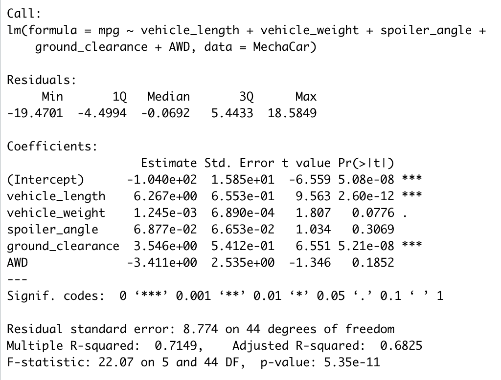
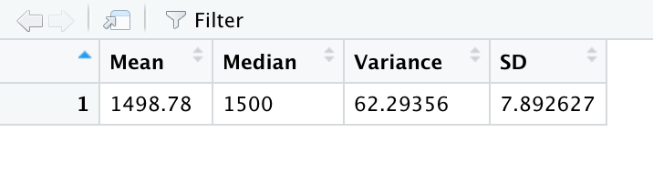
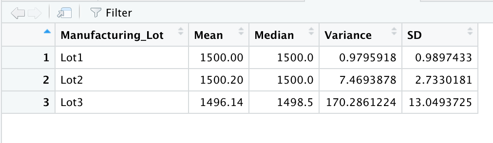
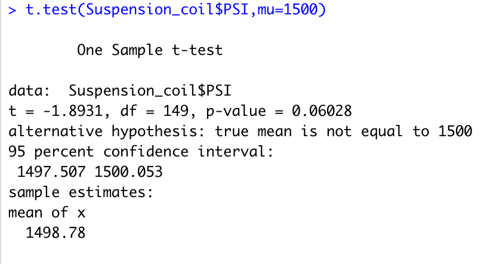
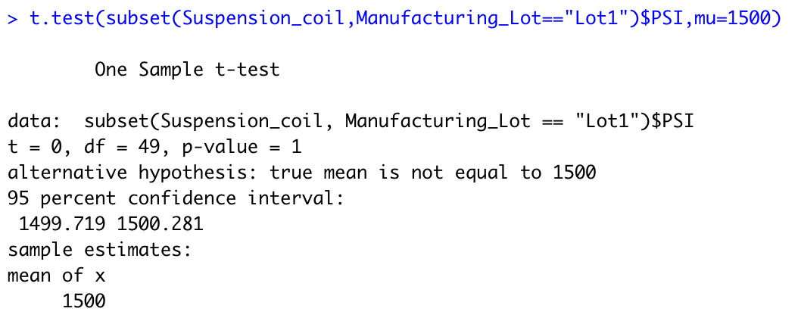
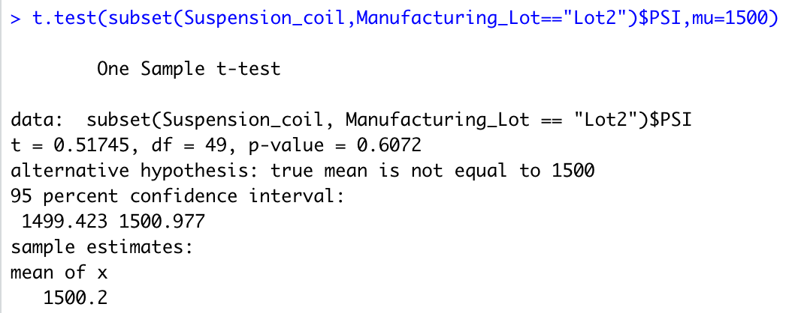
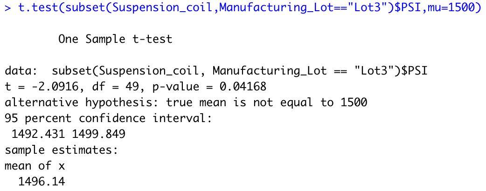

# MechaCar_Statistical_Analysis
## Goal/Outlook
- Perform multiple linear regression analysis to identify which variables in the dataset predict the mpg of MechaCar prototypes
- Collect summary statistics on the pounds per square inch (PSI) of the suspension coils from the manufacturing lots
- Run t-tests to determine if the manufacturing lots are statistically different from the mean population
- Design a statistical study to compare vehicle performance of the MechaCar vehicles against vehicles from other manufacturers. For each statistical analysis, you’ll write a summary interpretation of the findings.

## Linear Regression to Predict MPG

- Which variables/coefficients provided a non-random amount of variance to the mpg values in the dataset?
 The vehicle length and the Ground Clearance are not likeley to provide any variance to the mpg as they don't have any impact. 
 
- Is the slope of the linear model considered to be zero? Why or why not?
No it is not zero, the p-value is 5.35e^-11, therefore we can reject the nill hypothesis and say it isn't zero. 

- Does this linear model predict mpg of MechaCar prototypes effectively? Why or why not?
The r-squared value is 0.7149 which means the R squared value as a percentage would be 71.49% which means the model is effective using this linear model.

## Summary Statistics on Suspension Coils

- The design specifications for the MechaCar suspension coils dictate that the variance of the suspension coils must not exceed 100 pounds per square inch. Does the current manufacturing data meet this design specification for all manufacturing lots in total and each lot individually? Why or why not?
From the first image we can see that the variance is 62.29356 which shows that they meet the criteria of 100 lbs per sq inch but when taken into account seperately instead of totaling we can see that lot 3 has a variance which is 170.2861224 which exceeds the criteria of 100 lbs per sq inch so the 3rd Lot doesn;t meet the requirement. (71 over the limitation)

## T-Tests on Suspension Coils

## Study Design: MechaCar vs Competetion
